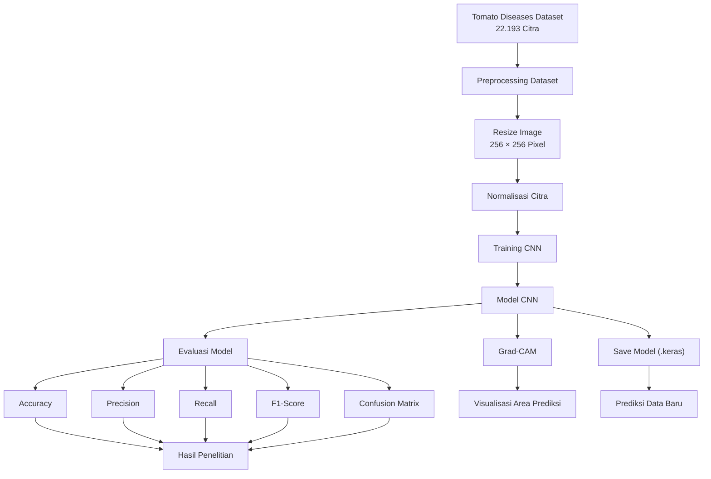
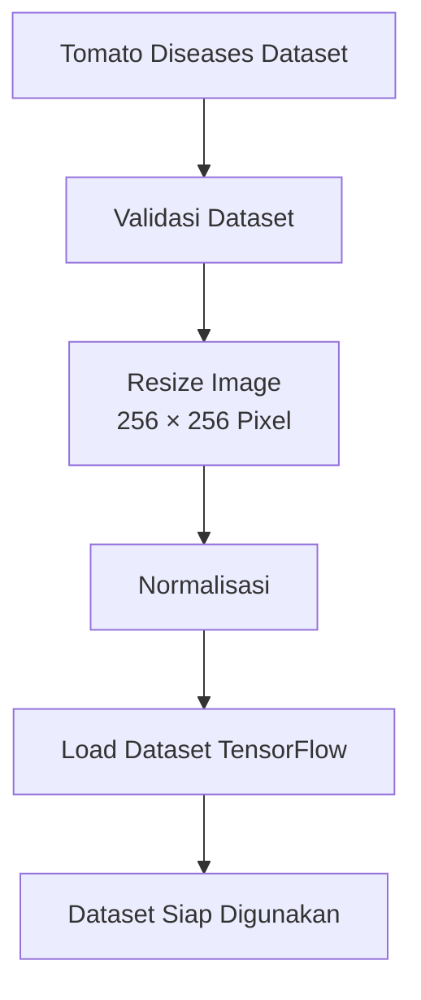
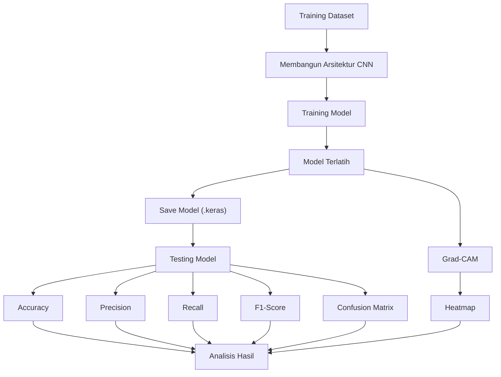
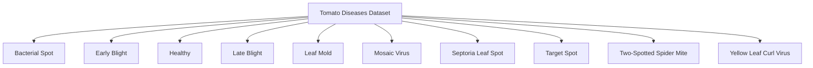

# Arsitektur Sistem dan Landasan Teori

Dokumen ini menjelaskan arsitektur sistem, desain penelitian, variabel penelitian, serta landasan teori yang digunakan sebagai dasar implementasi model Convolutional Neural Network (CNN) pada penelitian klasifikasi penyakit daun tomat.

**Judul Penelitian:**
Klasifikasi Penyakit Daun Tomat Menggunakan Convolutional Neural Network (CNN) dengan Visualisasi Grad-CAM

**Peneliti:**
Kavina Reyna Riyadi

**Status:**
Tahap Perancangan Metodologi, Implementasi Sistem, Pelatihan Model, dan Evaluasi

---

# 1. Arsitektur Komponen Sistem

Penelitian ini merupakan penelitian eksperimen berbasis klasifikasi citra menggunakan **Convolutional Neural Network (CNN)**. Seluruh proses dilakukan menggunakan **Tomato Diseases Dataset** dari Kaggle. Dataset diproses melalui tahap preprocessing, pelatihan model, evaluasi performa, hingga visualisasi hasil prediksi menggunakan **Grad-CAM**.

---

# 2. Alur Preprocessing Data

Tahap preprocessing dilakukan sebelum proses pelatihan model agar seluruh citra memiliki ukuran dan format yang seragam.

Tahapan preprocessing meliputi:

- Memuat dataset.
- Pemeriksaan struktur folder.
- Resize citra menjadi **256 × 256 piksel**.
- Normalisasi nilai piksel.
- Pembentukan dataset training dan testing.

---

# 3. Alur Pelatihan dan Evaluasi Model

Model CNN dibangun menggunakan beberapa lapisan konvolusi (*Convolution Layer*), fungsi aktivasi ReLU, Max Pooling, Flatten, dan Dense Layer.

Setelah model selesai dilatih, dilakukan evaluasi menggunakan beberapa metrik performa. Selanjutnya diterapkan Grad-CAM untuk mengetahui area citra yang menjadi perhatian model saat melakukan klasifikasi.

---

# 4. Desain Variabel Penelitian

## 4.1 Variabel Independen (Independent Variable)

Variabel independen merupakan metode yang digunakan dalam penelitian.

| Variabel | Jenis | Keterangan |
|----------|------|------------|
| Convolutional Neural Network (CNN) | Independent Variable | Model Deep Learning yang digunakan untuk mengklasifikasikan penyakit daun tomat |

---

## 4.2 Variabel Dependen (Dependent Variable)

Variabel dependen merupakan performa model klasifikasi.

| Variabel | Metrik |
|----------|---------|
| Accuracy | Persentase prediksi yang benar |
| Precision | Ketepatan prediksi setiap kelas |
| Recall | Kemampuan model mengenali kelas sebenarnya |
| F1-Score | Keseimbangan antara Precision dan Recall |
| Confusion Matrix | Distribusi hasil klasifikasi |
| Grad-CAM | Interpretasi visual hasil prediksi |

---

## 4.3 Variabel Kontrol

| Variabel | Nilai |
|----------|-------|
| Dataset | Tomato Diseases Dataset |
| Jumlah Kelas | 10 |
| Ukuran Citra | 256 × 256 piksel |
| Optimizer | Adam |
| Loss Function | Categorical Crossentropy |
| Framework | TensorFlow / Keras |
| Output | 10 kelas penyakit |

> **Catatan:** Nilai epoch dan batch size disesuaikan dengan skenario eksperimen yang dijalankan pada penelitian.

---

# 5. Struktur Dataset

Dataset yang digunakan adalah **Tomato Diseases Dataset** dari Kaggle.

Dataset terdiri atas **10 kelas penyakit** dengan total **22.193 citra**, yang dibagi menjadi **17.753 data training** dan **4.440 data testing**.

### Distribusi Data Training

| Kelas | Jumlah |
|---------|-------:|
| Bacterial Spot | 1.679 |
| Early Blight | 2.177 |
| Healthy | 1.883 |
| Late Blight | 2.093 |
| Leaf Mold | 1.460 |
| Mosaic Virus | 1.197 |
| Septoria Leaf Spot | 1.327 |
| Target Spot | 1.110 |
| Two-Spotted Spider Mite | 1.232 |
| Yellow Leaf Curl Virus | 3.595 |
| **Total** | **17.753** |

### Data Testing

Seluruh kelas memiliki **444 citra**, sehingga total data testing adalah **4.440 citra**.
# 6. Landasan Teori

## 6.1 Artificial Intelligence (AI)

Artificial Intelligence (AI) merupakan cabang ilmu komputer yang bertujuan mengembangkan sistem yang mampu meniru kemampuan manusia dalam berpikir, belajar, mengambil keputusan, dan menyelesaikan suatu permasalahan secara otomatis. AI memanfaatkan berbagai teknik komputasi untuk mengolah data sehingga dapat menghasilkan prediksi maupun rekomendasi yang mendukung pengambilan keputusan.

Dalam bidang pertanian, Artificial Intelligence telah banyak diterapkan untuk membantu proses identifikasi penyakit tanaman, pemantauan kondisi lahan, prediksi hasil panen, serta otomatisasi sistem pertanian. Salah satu penerapan AI yang berkembang pesat adalah penggunaan Computer Vision untuk mengenali penyakit tanaman berdasarkan citra daun.

Pada penelitian ini, Artificial Intelligence menjadi landasan utama dalam pengembangan sistem klasifikasi penyakit daun tomat secara otomatis menggunakan metode Deep Learning.

---

## 6.2 Machine Learning

Machine Learning merupakan bagian dari Artificial Intelligence yang memungkinkan komputer mempelajari pola dari data tanpa diprogram secara eksplisit. Model Machine Learning dibangun melalui proses pelatihan menggunakan data sehingga mampu melakukan prediksi terhadap data baru yang belum pernah dilihat sebelumnya.

Machine Learning dibagi menjadi beberapa kategori, yaitu Supervised Learning, Unsupervised Learning, dan Reinforcement Learning. Penelitian ini menggunakan pendekatan **Supervised Learning**, karena seluruh citra daun tomat telah memiliki label kelas yang digunakan selama proses pelatihan model.

Melalui proses pembelajaran tersebut, model dapat mengenali karakteristik masing-masing penyakit daun tomat berdasarkan pola visual yang terdapat pada citra.

---

## 6.3 Deep Learning

Deep Learning merupakan pengembangan dari Machine Learning yang menggunakan jaringan saraf tiruan (*Artificial Neural Network*) dengan banyak lapisan (*hidden layer*) sehingga mampu mempelajari representasi data secara otomatis.

Berbeda dengan metode Machine Learning konvensional yang membutuhkan ekstraksi fitur secara manual, Deep Learning mampu melakukan ekstraksi fitur langsung dari citra melalui proses pembelajaran. Hal tersebut membuat Deep Learning sangat efektif digunakan dalam klasifikasi citra digital, termasuk klasifikasi penyakit tanaman.

Dalam penelitian ini, Deep Learning digunakan untuk membangun model klasifikasi penyakit daun tomat menggunakan arsitektur Convolutional Neural Network (CNN).

---

## 6.4 Convolutional Neural Network (CNN)

Convolutional Neural Network (CNN) merupakan salah satu arsitektur Deep Learning yang dirancang khusus untuk mengolah data berbentuk citra. CNN mampu mengenali pola visual seperti tepi, tekstur, bentuk, dan objek melalui proses konvolusi sehingga sangat sesuai digunakan pada permasalahan klasifikasi citra.

Secara umum, CNN terdiri atas beberapa lapisan utama, yaitu:

### a. Convolution Layer

Lapisan konvolusi berfungsi mengekstraksi fitur dari citra menggunakan filter (*kernel*). Setiap filter menghasilkan feature map yang merepresentasikan karakteristik tertentu dari citra, seperti garis, sudut, maupun tekstur.

### b. Activation Function (ReLU)

Setelah proses konvolusi dilakukan, hasilnya dilewatkan ke fungsi aktivasi Rectified Linear Unit (ReLU).

Fungsi ReLU didefinisikan sebagai:

\[
f(x)=\max(0,x)
\]

ReLU membantu model mempelajari hubungan nonlinier sekaligus mempercepat proses pelatihan.

### c. Max Pooling Layer

Pooling digunakan untuk mengurangi ukuran feature map sehingga jumlah parameter menjadi lebih sedikit dan proses komputasi menjadi lebih efisien.

Penelitian ini menggunakan **Max Pooling**, yaitu memilih nilai maksimum pada setiap area pooling.

### d. Flatten Layer

Flatten mengubah data dua dimensi hasil konvolusi menjadi vektor satu dimensi agar dapat diproses oleh lapisan Fully Connected.

### e. Fully Connected Layer

Lapisan ini menghubungkan seluruh neuron hasil ekstraksi fitur untuk menghasilkan keputusan klasifikasi.

### f. Softmax

Lapisan Softmax digunakan pada lapisan keluaran untuk menghitung probabilitas setiap kelas penyakit.

Kelas dengan probabilitas terbesar akan dipilih sebagai hasil prediksi.

Pada penelitian ini digunakan **Custom CNN** yang dibangun menggunakan TensorFlow/Keras, terdiri atas beberapa lapisan Convolution, Max Pooling, Flatten, dan Dense Layer untuk mengklasifikasikan sepuluh kelas penyakit daun tomat.

---

## 6.5 Gradient-weighted Class Activation Mapping (Grad-CAM)

Grad-CAM (*Gradient-weighted Class Activation Mapping*) merupakan salah satu metode Explainable Artificial Intelligence (XAI) yang digunakan untuk memberikan interpretasi terhadap hasil prediksi model Deep Learning.

Grad-CAM bekerja dengan menghitung gradien dari kelas yang diprediksi terhadap feature map pada lapisan konvolusi terakhir. Hasil gradien tersebut kemudian digunakan untuk menghasilkan heatmap yang menunjukkan area citra yang paling berpengaruh terhadap keputusan model.

Melalui visualisasi tersebut, pengguna dapat mengetahui bagian daun yang menjadi perhatian model ketika melakukan klasifikasi.

Pada penelitian ini, Grad-CAM digunakan setelah proses evaluasi model untuk memverifikasi apakah model benar-benar memanfaatkan area penyakit pada daun tomat saat menghasilkan prediksi.

---

## 6.6 TensorFlow dan Keras

TensorFlow merupakan framework open-source yang dikembangkan oleh Google untuk membangun dan melatih model Machine Learning maupun Deep Learning.

Keras merupakan antarmuka tingkat tinggi yang terintegrasi dengan TensorFlow sehingga mempermudah proses pembangunan model melalui API yang lebih sederhana.

Dalam penelitian ini TensorFlow dan Keras digunakan untuk:

- memuat dataset,
- membangun arsitektur CNN,
- melakukan proses pelatihan model,
- menyimpan model,
- melakukan evaluasi,
- menghasilkan prediksi,
- mengimplementasikan Grad-CAM.

---

## 6.7 Tomato Diseases Dataset

Dataset yang digunakan dalam penelitian ini adalah **Tomato Diseases Dataset** yang diperoleh dari platform Kaggle. Dataset terdiri atas citra daun tomat yang telah diberi label berdasarkan jenis penyakit maupun kondisi daun sehat.

Dataset terdiri atas sepuluh kelas, yaitu:

1. Bacterial Spot
2. Early Blight
3. Healthy
4. Late Blight
5. Leaf Mold
6. Mosaic Virus
7. Septoria Leaf Spot
8. Target Spot
9. Two-Spotted Spider Mite
10. Yellow Leaf Curl Virus

Jumlah data yang digunakan pada penelitian ini meliputi:

| Dataset | Jumlah |
|---------|-------:|
| Training | 17.753 |
| Testing | 4.440 |
| Total | 22.193 |

Seluruh citra telah memiliki resolusi yang seragam sehingga proses preprocessing difokuskan pada resize, normalisasi, dan pembentukan dataset sebelum dilakukan pelatihan model.

---

## 6.8 Data Preprocessing

Data preprocessing merupakan tahapan awal yang bertujuan mempersiapkan dataset sebelum digunakan pada proses pelatihan model.

Tahapan preprocessing pada penelitian ini meliputi:

- Memuat dataset dari folder.
- Resize citra menjadi 256 × 256 piksel.
- Normalisasi nilai piksel ke rentang 0–1.
- Membentuk dataset training dan testing menggunakan TensorFlow.
- Mengubah label menjadi format kategorikal agar sesuai dengan proses klasifikasi multikelas.

Tahapan preprocessing yang konsisten membantu model mempelajari pola citra dengan lebih baik sehingga dapat meningkatkan performa klasifikasi.
## 6.9 Evaluasi Model

Setelah proses pelatihan selesai, model dievaluasi untuk mengetahui kemampuannya dalam mengklasifikasikan penyakit daun tomat. Evaluasi dilakukan menggunakan beberapa metrik yang diperoleh dari hasil prediksi terhadap data uji.

### Accuracy

Accuracy merupakan persentase jumlah prediksi yang benar dibandingkan dengan seluruh data pengujian.

\[
Accuracy=\frac{TP+TN}{TP+TN+FP+FN}
\]

Semakin tinggi nilai accuracy menunjukkan semakin baik kemampuan model dalam melakukan klasifikasi.

---

### Precision

Precision menunjukkan tingkat ketepatan model ketika memberikan prediksi terhadap suatu kelas.

\[
Precision=\frac{TP}{TP+FP}
\]

Nilai precision yang tinggi menunjukkan bahwa sebagian besar prediksi yang diberikan model benar.

---

### Recall

Recall menunjukkan kemampuan model dalam menemukan seluruh data yang benar pada setiap kelas.

\[
Recall=\frac{TP}{TP+FN}
\]

Nilai recall yang tinggi menunjukkan bahwa model mampu mengenali sebagian besar data pada kelas tersebut.

---

### F1-Score

F1-Score merupakan rata-rata harmonik antara precision dan recall.

\[
F1=\frac{2\times Precision\times Recall}{Precision+Recall}
\]

F1-Score digunakan ketika precision dan recall sama-sama penting untuk diperhatikan.

---

### Confusion Matrix

Confusion Matrix merupakan tabel yang menunjukkan jumlah prediksi benar maupun salah pada setiap kelas.

Melalui Confusion Matrix dapat diketahui kelas penyakit yang mudah dikenali maupun kelas yang sering mengalami kesalahan klasifikasi.

---

### Classification Report

Classification Report merupakan ringkasan hasil evaluasi yang berisi nilai Accuracy, Precision, Recall, dan F1-Score untuk setiap kelas penyakit.

Laporan ini memberikan gambaran yang lebih rinci mengenai performa model pada masing-masing kelas.

---

### Grad-CAM

Selain menggunakan metrik evaluasi, penelitian ini juga menerapkan **Gradient-weighted Class Activation Mapping (Grad-CAM)**.

Grad-CAM menghasilkan heatmap yang menunjukkan bagian citra daun tomat yang paling berpengaruh terhadap keputusan model.

Visualisasi tersebut digunakan untuk:

- memverifikasi bahwa model mempelajari area penyakit,
- meningkatkan interpretasi hasil prediksi,
- membantu analisis kesalahan klasifikasi.

---

# 7. Keputusan Desain Penelitian

Berikut keputusan desain yang digunakan selama penelitian.

| Aspek | Keputusan | Justifikasi |
|-------|-----------|-------------|
| Dataset | Tomato Diseases Dataset (Kaggle) | Dataset publik dengan 10 kelas penyakit daun tomat |
| Model | Custom Convolutional Neural Network (CNN) | Sesuai tujuan penelitian untuk membangun model CNN |
| Image Size | 256 × 256 piksel | Menyeragamkan ukuran seluruh citra |
| Optimizer | Adam | Memiliki konvergensi yang stabil pada proses pelatihan |
| Loss Function | Categorical Crossentropy | Digunakan untuk klasifikasi multikelas |
| Framework | TensorFlow & Keras | Mendukung pembangunan dan pelatihan model CNN |
| Evaluasi | Accuracy, Precision, Recall, F1-Score, Confusion Matrix | Mengukur performa klasifikasi |
| Explainability | Grad-CAM | Memberikan interpretasi visual terhadap hasil prediksi |
| Output Model | .keras | Memudahkan proses penyimpanan dan penggunaan kembali model |

> Parameter seperti **epoch**, **batch size**, dan **learning rate** mengikuti skenario eksperimen yang dijalankan selama proses pelatihan model.

---

# 8. Mapping Implementasi Kode

| Komponen | Implementasi |
|----------|--------------|
| Dataset Loader | TensorFlow Dataset |
| Preprocessing | Resize, Normalisasi |
| Image Size | 256 × 256 |
| Model | Custom CNN |
| Convolution Layer | Conv2D |
| Pooling Layer | MaxPooling2D |
| Activation | ReLU |
| Flatten | Flatten() |
| Fully Connected | Dense() |
| Output Layer | Softmax |
| Optimizer | Adam |
| Loss Function | Categorical Crossentropy |
| Training | model.fit() |
| Evaluasi | model.evaluate() |
| Prediksi | model.predict() |
| Confusion Matrix | scikit-learn |
| Classification Report | scikit-learn |
| Grad-CAM | TensorFlow GradientTape |
| Visualisasi | Matplotlib |
| Save Model | model.save() |

---

# 9. Referensi

Ferentinos, K. P. (2018). *Deep Learning Models for Plant Disease Detection and Diagnosis*. Computers and Electronics in Agriculture, 145, 311–318.

Goodfellow, I., Bengio, Y., & Courville, A. (2016). *Deep Learning*. MIT Press.

LeCun, Y., Bottou, L., Bengio, Y., & Haffner, P. (1998). *Gradient-Based Learning Applied to Document Recognition*. Proceedings of the IEEE, 86(11), 2278–2324.

Mohanty, S. P., Hughes, D. P., & Salathé, M. (2016). *Using Deep Learning for Image-Based Plant Disease Detection*. Frontiers in Plant Science, 7, 1419.

Selvaraju, R. R., Cogswell, M., Das, A., Vedantam, R., Parikh, D., & Batra, D. (2017). *Grad-CAM: Visual Explanations from Deep Networks via Gradient-based Localization*. Proceedings of the IEEE International Conference on Computer Vision (ICCV), 618–626.

Too, E. C., Yujian, L., Njuki, S., & Yingchun, L. (2019). *A Comparative Study of Fine-Tuning Deep Learning Models for Plant Disease Identification*. Computers and Electronics in Agriculture, 161, 272–279.

TensorFlow. (2024). *TensorFlow Official Documentation*. https://www.tensorflow.org/

Keras. (2024). *Keras Documentation*. https://keras.io/

---

# 10. Navigasi Repository

| Folder | Keterangan |
|--------|------------|
| 00-admin | Administrasi Penelitian |
| 01-proposal | Proposal Penelitian |
| 02-literatur | Studi Literatur |
| 04-data | Dataset Penelitian |
| 05-kode | Implementasi Model CNN |
| 06-output | Hasil Pelatihan, Evaluasi, dan Grad-CAM |
| 07-manuskrip | Manuskrip Penelitian |
| 08-laporan | Laporan Penelitian |
| 09-docs | Dokumentasi Penelitian |

---

# Ringkasan

Penelitian ini menerapkan **Convolutional Neural Network (CNN)** untuk mengklasifikasikan **10 kelas penyakit daun tomat** menggunakan **Tomato Diseases Dataset** dari Kaggle. Seluruh proses penelitian meliputi preprocessing citra, pelatihan model, evaluasi performa, serta interpretasi hasil prediksi menggunakan **Gradient-weighted Class Activation Mapping (Grad-CAM)**.

Performa model dievaluasi menggunakan **Accuracy, Precision, Recall, F1-Score, Classification Report**, dan **Confusion Matrix**. Selain menghasilkan model klasifikasi yang mampu mengenali berbagai jenis penyakit daun tomat, penelitian ini juga memberikan visualisasi area citra yang menjadi dasar pengambilan keputusan model sehingga hasil prediksi menjadi lebih mudah dipahami dan diinterpretasikan.

Dokumen ini menjadi landasan konseptual sekaligus panduan implementasi penelitian, mulai dari perancangan sistem, pembangunan model CNN, proses evaluasi, hingga analisis hasil eksperimen.